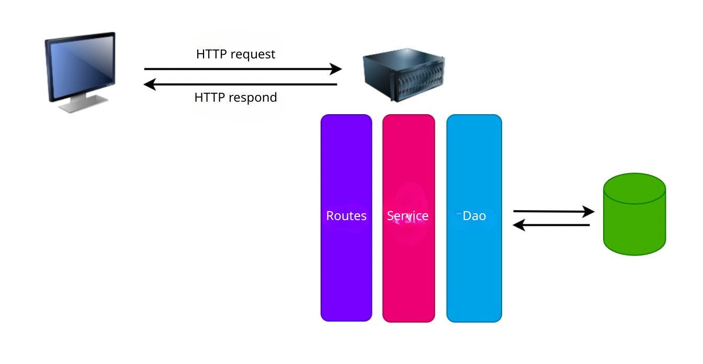
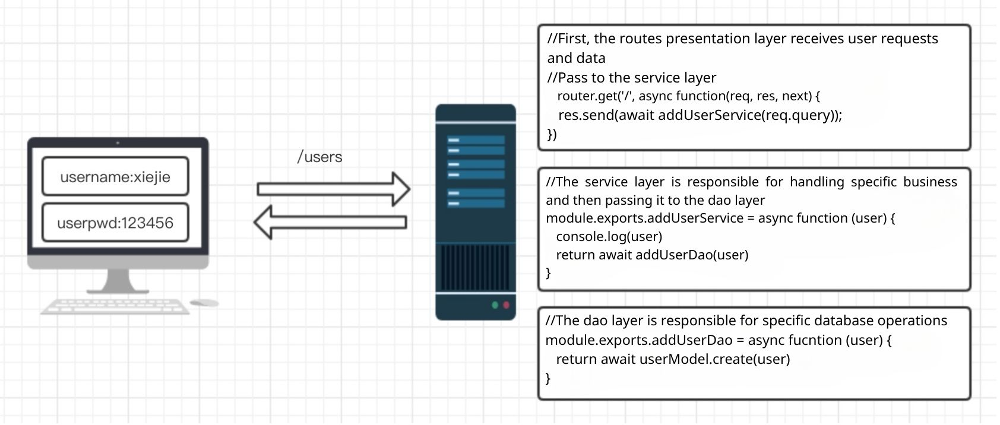
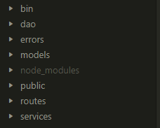

# Quickly Build a Server-Side 3-Tier Architecture with *Node.js*

This project will use a 3-tier architecture.

- Introduction to 3-Tier Architecture
- Simple Implementation of 3-Tier Architecture
  - Writing the Data Access Layer Code
  - Writing the Business Logic Layer Code
  - Writing the Presentation Layer Code
  - Project Testing

## Introduction to 3-Tier Architecture

What is a 3-tier architecture?

From the encyclopedia:

> The 3-tier architecture (*3-tier architecture*) generally divides the entire business application into:
>
> - User Interface Layer (*UI Layer*)
> - Business Logic Layer (*BLL*)
> - Data Access Layer (*DAL*)
>
> The purpose of separating layers is to follow the principle of "high cohesion and low coupling." In software architecture design, layered architecture is the most common and important structure. Microsoft's recommended layered structure typically consists of three layers, from bottom to top: Data Access Layer (also known as the Persistence Layer), Business Logic Layer, and Presentation Layer.

The roles of each layer are as follows:

- **Presentation Layer:** Mainly handles user requests and data responses, providing application access for the client.

- **Business Logic Layer:** Primarily responsible for operations on the data layer, combining various data layer operations.

- **Data Access Layer:** Focuses on operations on data files without concerning itself with other processes.

## Simple Implementation of 3-Tier Architecture

Next, we will implement a simple server-side 3-tier architecture using *Express*. See the diagram below:

First, use the *Express* scaffolding tool to create the project directory as shown below:

- *routes*: Presentation Layer
- *services*: Business Logic Layer
- *dao*: Data Access Layer
- *public*: Static Files Directory

---

-*EOF*-
